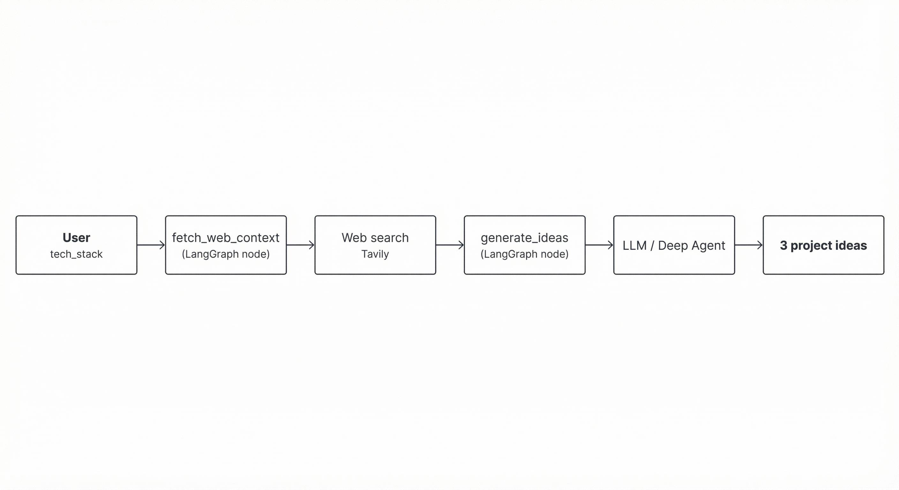

# Dev-Strom

**Get 3 concrete project ideas for any tech stack.** Enter a stack (e.g. LangChain, LangGraph); Dev-Strom searches the web for tutorials and articles, then uses an LLM to suggest three project ideas—each with a problem statement, why it fits the stack, real-world value, and an implementation plan.

---

## Quick start

```bash
git clone <repo-url>
cd Dev-Strom
python3 -m venv .venv
source .venv/bin/activate   # Windows: .venv\Scripts\activate
pip install -r requirements.txt
cp .env.example .env
```

Edit `.env` and set:

- **OPENAI_API_KEY** — for the idea-generation agent ([OpenAI](https://platform.openai.com/api-keys))
- **TAVILY_API_KEY** — for web search ([Tavily](https://tavily.com))

---

## How to run

| Option | Command | Description |
|--------|---------|-------------|
| **UI** | `streamlit run ui.py` | Browser UI: enter tech stack, click "Get ideas", see 3 ideas. Easiest way to try it. |
| **CLI** | `python scripts/run_graph.py "LangChain, LangGraph"` | Prints 3 ideas to the terminal. Add `--stream` to see state after each step; `--debug` for full traces. |
| **API** | `uvicorn api:api --reload` | HTTP server on port 8000. `POST /ideas` with `{"tech_stack": "..."}` returns `{"ideas": [...]}`. |

**Example (API):**

```bash
curl -X POST http://localhost:8000/ideas \
  -H "Content-Type: application/json" \
  -d '{"tech_stack": "React, Node.js, PostgreSQL"}'
```

**Docs (when API is running):** [http://localhost:8000/docs](http://localhost:8000/docs) (Swagger), [http://localhost:8000/redoc](http://localhost:8000/redoc) (ReDoc).

---

## Architecture



1. **Input:** User provides a tech stack string.
2. **fetch_web_context:** Calls the web search tool (Tavily), stores snippets in state.
3. **generate_ideas:** Deep Agent reads `tech_stack` + `web_context`, returns 3 ideas in a fixed schema.

| Layer | Role |
|-------|------|
| **LangGraph** | Orchestration: state and node order (fetch_web_context → generate_ideas). |
| **LangChain** | Web search tool and prompts. |
| **Deep Agents** | Idea generation inside the `generate_ideas` node (with optional middleware). |

**Output schema** (`schema.py`): Each idea has `name`, `problem_statement`, `why_it_fits` (list), `real_world_value`, `implementation_plan` (list of steps). Exactly 3 ideas per run.

---

## Project layout

| Path | Purpose |
|------|---------|
| `graph.py` | LangGraph definition: state, `fetch_web_context`, `generate_ideas`, compiled app. |
| `tools.py` | LangChain web search tool (Tavily). |
| `schema.py` | Pydantic models: `ProjectIdea`, `IdeasResponse`. |
| `api.py` | FastAPI app: `POST /ideas`. |
| `ui.py` | Streamlit app for browser testing. |
| `scripts/run_graph.py` | CLI entry point. |
| `md/PLAN.md` | Project plan and v1 scope. |
| `md/V1_TICKETS.md` | Jira-style tickets (DEVSTROM-1 … DEVSTROM-6). |

---

## License and docs

- **Plan and tickets:** [md/PLAN.md](md/PLAN.md), [md/V1_TICKETS.md](md/V1_TICKETS.md)
